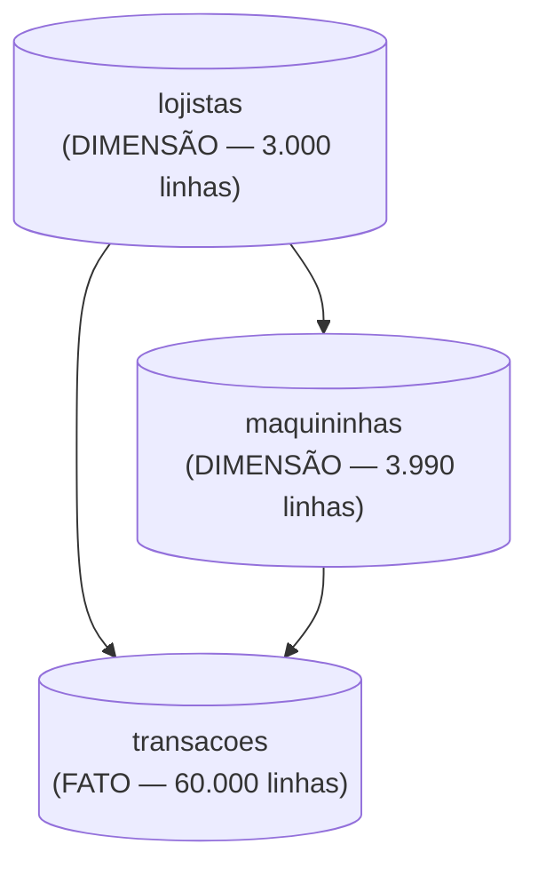

🏷️ Requisitos & Arquitetura

# Análise de Dados na Prática: Panorama de Pagamentos de uma Adquirente

Projeto de portfólio de Vitor Franca, engenheiro civil migrando para análise de dados. Este documento segue o modelo de documentação padrão do portfólio (`MODELO_DOCUMENTACAO_ANALISE_DADOS.md`) — mesma estrutura usada nos outros projetos, só trocando o domínio e os dados.

Repositório: `projeto-adquirencia-pagamentos` (GitHub) · Dashboard: Power BI

---

## Requisitos e Configurações do Projeto

### 1. Pré-requisitos de Software (Ambiente Local)

* PostgreSQL 14+ (instalação local, com `psql` e pgAdmin 4)
* Power BI Desktop
* Python 3.x, para gerar a base sintética
* Conta no GitHub
* Dataset: CSVs sintéticos gerados em Python (`lojistas.csv`, `maquininhas.csv`, `transacoes.csv`)

### 2. Fundamentos das Tecnologias

PostgreSQL – Conceitos Fundamentais (schema, DDL, constraints, window functions, CTE)
Power BI – Conceitos Fundamentais (modelo semântico, medidas DAX, colunas calculadas, mês anterior sem tabela calendário)
GitHub – Conceitos Fundamentais (repositório, README, commits)
Modelagem Relacional – Fundamentos (tabela dimensão x tabela fato)

### Dataset - Informações

Base sintética gerada em Python, calibrada com padrões públicos de mercado de adquirência (faixas de MDR por modalidade, taxa de aprovação em torno de 90-92%, chargeback rate abaixo de 2%) para ficar fiel ao padrão real de uma operadora de maquininhas — MDR crescente conforme o parcelamento, pico de volume em novembro/dezembro puxado por Black Friday e Natal, concentração de TPV em lojistas de porte maior.

---

### 3. Principais Conceitos de Dados Utilizados

**Schema**
Namespace dentro do banco de dados que agrupa as tabelas do projeto (`adquirencia`), separado do schema `public` padrão.
________________

**TPV (Total Payment Volume)**
Soma do valor bruto de todas as transações aprovadas — o principal indicador de volume de uma adquirente.
________________

**MDR (Merchant Discount Rate)**
Percentual descontado do lojista em cada transação como taxa de intermediação. Varia por modalidade: menor no débito, maior no crédito parcelado.
________________

**Chargeback**
Estorno forçado de uma transação, iniciado pelo titular do cartão ou pela bandeira — indicador de risco/fraude da operação.
________________

**Window function `LAG`**
Função que traz o valor de uma linha anterior dentro de uma janela ordenada — usada para comparar o TPV de um mês contra o mês anterior sem precisar de tabela calendário.
________________

**Window function `RANK`**
Função que atribui uma posição de ranking dentro de uma janela ordenada — usada para ranquear lojistas por TPV e segmentos por chargeback rate.
________________

**CTE (Common Table Expression)**
Tabela temporária criada dentro de uma query usando `WITH`, usada para organizar os 10 blocos de KPI em passos legíveis.
________________

**Antecipação de recebíveis**
Operação em que o lojista opta por receber o valor de uma venda a crédito antes do prazo padrão (D+30), mediante uma taxa adicional.
________________

**Medida DAX**
No Power BI, cálculo definido em DAX que agrega dados sob demanda, como `Taxa Aprovacao % = DIVIDE([Aprovadas], [Transacoes Totais])`.
________________

**Modelo semântico**
Camada do Power BI onde ficam as tabelas, relacionamentos e medidas — a base sobre a qual os gráficos do dashboard são construídos.

---

## ◾ Fluxo das Ferramentas (Arquitetura do Projeto)


Mesmo diagrama gerado no Claude Design usado nos outros projetos do portfólio (prompt salvo em `PROMPTS_CLAUDE_DESIGN.md`) — o pipeline de ferramentas é idêntico entre os projetos, só muda o domínio dos dados. Não precisa gerar um novo diagrama pra isso.

Papel de cada etapa no pipeline: Python entrega os dados brutos em CSV; PostgreSQL é onde o dado é modelado, limpo e analisado (é daqui que saem os números oficiais do projeto); Power BI transforma o resultado das análises num dashboard visual; GitHub documenta e publica o código e os resultados; LinkedIn divulga o projeto pronto.

---

## ◾ PostgreSQL - Conceitos

O PostgreSQL é o banco de dados relacional usado para modelar, limpar e analisar os dados do projeto.

Papel no pipeline: camada de modelagem e análise — é onde os CSVs viram tabelas estruturadas e onde saem todos os números usados no README e no dashboard.

Estrutura básica



Como foi usado no projeto: schema próprio (`adquirencia`, não `public`), com chaves primárias, foreign keys e constraints garantindo a integridade. Depois da carga, roda-se limpeza (nulos, colunas derivadas como `ano_mes`, `aprovada`, `chargeback`) e os blocos de análise com CTE, `RANK`, `LAG` e `PERCENTILE_CONT`.

Comandos principais

| Comando | O que faz |
|---|---|
| `psql -f 02_sql/01_criar_tabelas.sql` | Cria o schema, as tabelas, constraints e índices |
| `\copy tabela FROM 'arquivo.csv' WITH (FORMAT csv, HEADER true, DELIMITER ';')` | Carrega os dados do CSV na tabela |
| `SET search_path TO adquirencia, public;` | Aponta a sessão pro schema do projeto |
| `psql -f 02_sql/04_analises.sql` | Roda os blocos de KPI (TPV, ranking de lojistas, evolução mensal) |

---

## ◾ Python - Conceitos

Usado só na etapa de geração da base sintética: cria os três CSVs (`lojistas`, `maquininhas`, `transacoes`) calibrados com padrões públicos de mercado de adquirência, simulando uma operação nacional sem usar dado real de nenhuma empresa.

---

## ◾ Power BI - Conceitos

O Power BI é a ferramenta de BI usada para montar o dashboard final do projeto.

Papel no pipeline: recebe o modelo direto dos CSVs de `03_dados/` e transforma os resultados das análises em visuais interativos.

Como foi usado no projeto: modelo semântico com relacionamentos `lojistas → transacoes` e `maquininhas → transacoes` (1 para muitos), colunas calculadas espelhando a limpeza feita em SQL, e medidas DAX — `Transacoes Totais`, `Aprovadas`, `TPV`, `Ticket Medio`, `Taxa Aprovacao %`, `Chargeback Rate %`, `Receita MDR`, `MDR Medio Blended %`, `TPV Mes Anterior`, `Crescimento MoM %` entre outras.

Visuais usados, pelo nome exato no painel Visualizações do Power BI Desktop: **Cartão** (KPIs de topo), **Gráfico de Linhas** (evolução mensal), **Gráfico de Rosca** (TPV por bandeira), **Gráfico de Barras Agrupadas** (ranking de lojistas), **Gráfico de Colunas Clusterizadas e Linhas** (modalidade x MDR, eixo duplo) e **Gráfico de Colunas Agrupadas** (TPV por região — no lugar do visual de Mapa, evitando a dependência de geocodificação via Bing/Azure Maps já mapeada como armadilha nos outros projetos).

---

## ◾ GitHub - Conceitos

Repositório público usado para publicar o código, os dados e a documentação do projeto.

Estrutura padrão de pastas

```
02_sql/
  01_criar_tabelas.sql    — DDL: schema, PKs, FKs, constraints, índices
  02_carregar_dados.sql   — \COPY dos CSV
  03_limpeza.sql          — nulos, colunas derivadas
  04_analises.sql         — 10 blocos de KPI

03_dados/
  lojistas.csv, maquininhas.csv, transacoes.csv

06_prints/
  fluxograma_ferramentas.png, prints reais da execução no PostgreSQL, print do dashboard final

README.md
GUIA_POWER_BI.md
05_post_linkedin.md
```

Regra de conteúdo do README: título, base de dados, como o projeto foi montado, estrutura do repositório, o que o dashboard mostra, rodando localmente, autor.

---

## 🎲 Dataset - Informações

### TABELA: lojistas (dimensão)

Descrição: cadastro dos lojistas atendidos pela adquirente.

Colunas
* `lojista_id` — identificador único
* `nome_fantasia` — nome fictício do lojista
* `segmento` — Varejo, Alimentação, Serviços, Saúde, Moda e Beleza, Educação ou Outros
* `porte` — MEI, Pequena, Média ou Grande
* `plano_taxa` — Standard, Premium ou Enterprise
* `uf`, `cidade`, `regiao` — localização do lojista
* `data_cadastro` — data de entrada na base de clientes

### TABELA: maquininhas (dimensão)

Descrição: terminais físicos ativados por lojista (um lojista pode ter mais de uma).

Colunas
* `maquininha_id` — identificador único
* `lojista_id` — referência ao lojista dono do terminal
* `modelo` — Modelo Chip Básico, Modelo Pro c/ Impressora ou Modelo Smart Android
* `data_ativacao` — data de ativação do terminal
* `status` — Ativa, Inativa ou Bloqueada

### TABELA: transacoes (fato)

Descrição: cada linha é uma transação processada em 2024.

Colunas
* `transacao_id` — identificador único da transação
* `lojista_id`, `maquininha_id` — referências às dimensões
* `data_transacao` — timestamp da transação
* `bandeira` — Visa, Mastercard, Elo, Amex ou Outras
* `modalidade` — Débito, Crédito à Vista ou Crédito Parcelado
* `parcelas` — número de parcelas (1 para débito e crédito à vista)
* `valor_bruto`, `taxa_mdr_pct`, `valor_taxa`, `valor_liquido` — valores financeiros da transação
* `status` — Aprovada, Negada ou Chargeback
* `motivo` — motivo da negativa ou do chargeback, quando houver
* `antecipada` — se o lojista antecipou o recebível
* `prazo_recebimento_dias` — prazo de liquidação (D+1 débito ou antecipado, D+30 crédito normal)

### Relação entre as tabelas

`lojista_id` conecta `lojistas` a `transacoes` e a `maquininhas`. `maquininha_id` conecta `maquininhas` a `transacoes`. `transacoes` é a tabela fato usada para medir TPV, MDR, taxa de aprovação e evolução mensal.

### Números reais confirmados (base de verdade — não inventar)

* 60.000 transações · 54.693 aprovadas · 4.114 negadas · 1.193 chargebacks
* Taxa de aprovação geral: 91,16% · Chargeback rate: 1,99%
* TPV total: R$ 7.710.096,87 · Ticket médio: R$ 140,97 · Receita de MDR: R$ 203.760,95 · MDR médio blended: 2,64%
* TPV por bandeira, do maior pro menor: Visa 38,05% · Mastercard 34,62% · Elo 18,27% · Amex 5,17% · Outras 3,89%
* MDR médio por modalidade: Crédito Parcelado 4,34% · Crédito à Vista 2,85% · Débito 1,35%
* TPV mensal: de R$ 489.705,76 em janeiro a R$ 1.038.482,90 em dezembro, com salto de +32,81% em novembro
* Top motivo de negada: cartão bloqueado (17,94% das negadas) · Top motivo de chargeback: duplicidade de cobrança (21,96% dos chargebacks)

Esses números vieram de execução real de SQL contra a base — qualquer texto novo (README, post do LinkedIn, este documento) tem que bater com eles.

---

## 📋 Checklist de Execução (substitui os capítulos de vídeo — este projeto não tem vídeo)

1. Definir o domínio do projeto (adquirência de pagamentos) e o escopo de dados
2. Gerar a base sintética em Python, calibrada com padrões de mercado reais
3. Escrever o DDL com schema próprio + constraints
4. Carregar e validar os dados (contagens batendo com o esperado)
5. Rodar limpeza e as análises reais em SQL — anotar os números exatos
6. Montar o dashboard em Power BI (extração via CSV, modelo, medidas, gráficos)
7. Criar o repositório no GitHub seguindo a estrutura de pastas padrão
8. Escrever o README seguindo o padrão de seções
9. Tirar os prints reais da execução (nunca fabricar print ou número)
10. Escrever o post do LinkedIn com os mesmos números do README
11. Revisar tudo contra a base real antes de publicar

---

## Armadilhas já mapeadas (para não repetir em projetos futuros)

* CSVs usam `;` como delimitador — sempre `DELIMITER ';'` no `\copy`.
* Tabelas ficam no schema `adquirencia`, não em `public` — sempre `SET search_path` antes de qualquer query.
* Colunas com valores nulos misturados a inteiros viram `float` no pandas (`1.0` em vez de `1`) e quebram o `COPY` num campo `SMALLINT` — usar `Int64` (nullable) do pandas antes de exportar pro CSV.
* Coluna booleana exportada como `True`/`False` do pandas é aceita pelo `COPY` do Postgres, mas o mais seguro é mapear explicitamente para `t`/`f` antes de salvar o CSV.
* Combinar duas medidas em escalas muito diferentes (Ticket Médio em reais e MDR em percentual) no mesmo eixo de um gráfico de colunas agrupadas achata a menor — usar **Gráfico de Colunas Clusterizadas e Linhas** com a segunda medida na "Linha" (eixo secundário).
* O visual de **Mapa** do Power BI depende de geocodificação via Bing/Azure Maps (conta Microsoft necessária, risco de confundir UF brasileira com estado americano) — nesse projeto, optou-se direto por **Gráfico de Colunas Agrupadas** por região em vez de tentar o mapa nativo.
* Servidor PostgreSQL rodando em ambiente sandbox/isolado morre entre execuções separadas de terminal — subir o servidor e rodar todos os scripts dentro da mesma sessão de comando.
* Conferir sempre se os números do texto batem com os números reais da execução antes de publicar.
